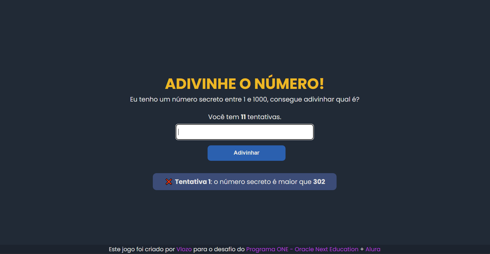

# Jogo criado para praticar lógica de programação.
O desafio do curso da Alura propõe a criação de um jogo que auxilie na prática da lógica de programação com o objetivo de consolidar o 
aprendizado e oferecer uma experiência prática que seja amigável para os estudantes. A proposta é utilizar os fundamentos do aprendizado 
de lógica de programação unificados para que demonstrem ao aluno os diversos conceitos algorítmicos que uma aplicação pode ter.

A ideia do jogo do número secreto é desafiar o jogador a adivinhar em até 12 tentativas um número entre 1 e 1000 gerado aleatoriamente pelo computador. O jogo 
foi desenvolvido com JavaScript e pode ser executado diretamente no navegador.

<h1 align="center"><a href="https://emanoelcampos.github.io/jogo-adivinhacao/" target= "_blank">JOGUE AQUI</a></h1>

## Página do Jogo

